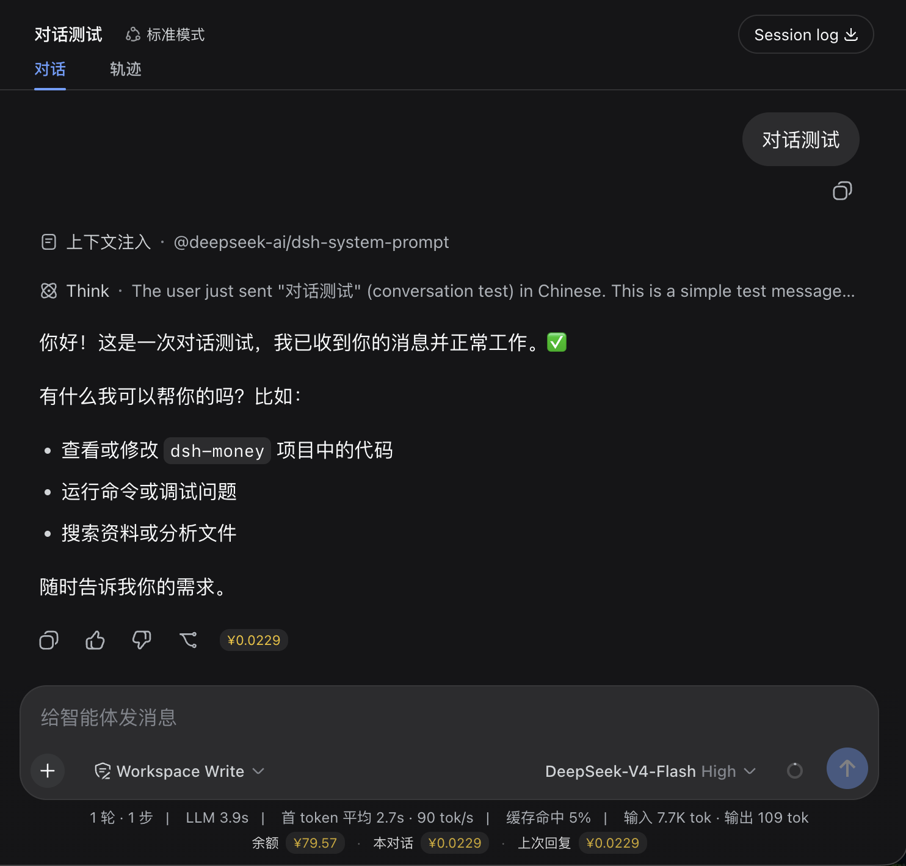
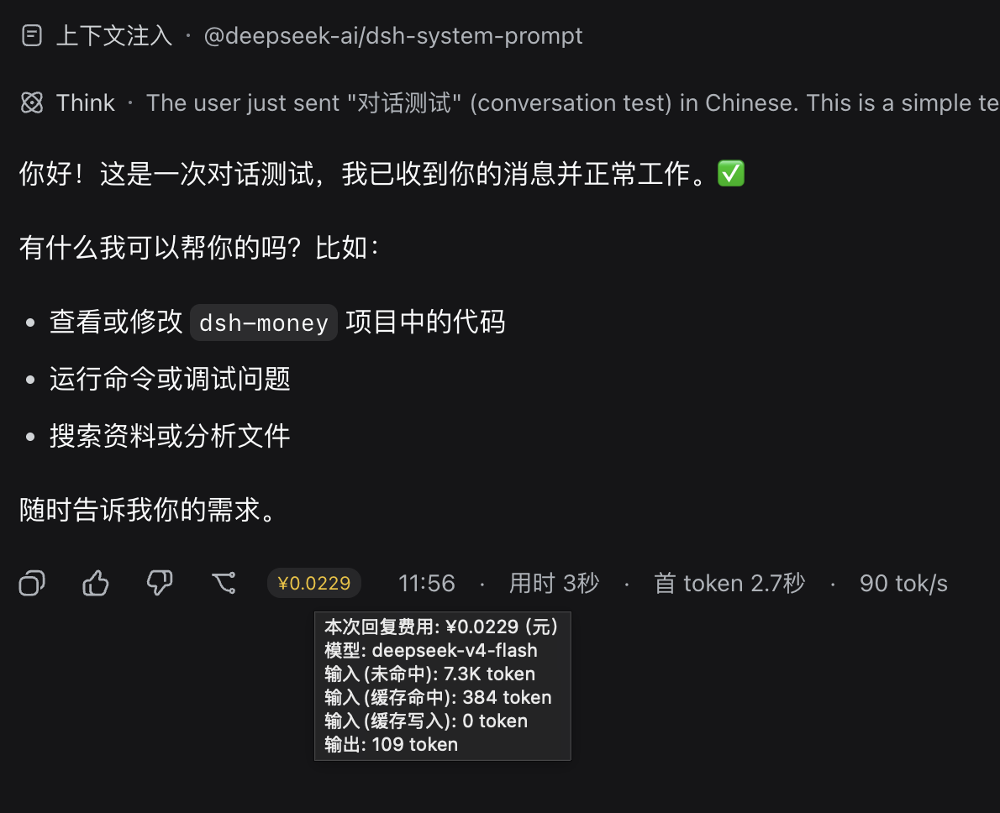
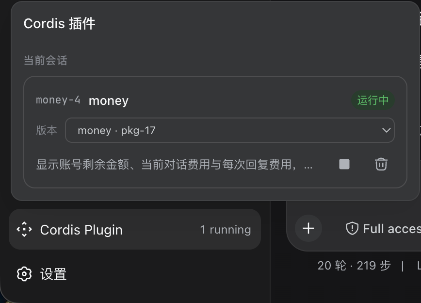
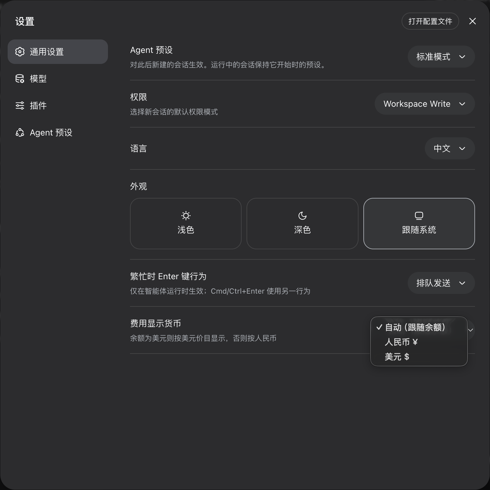
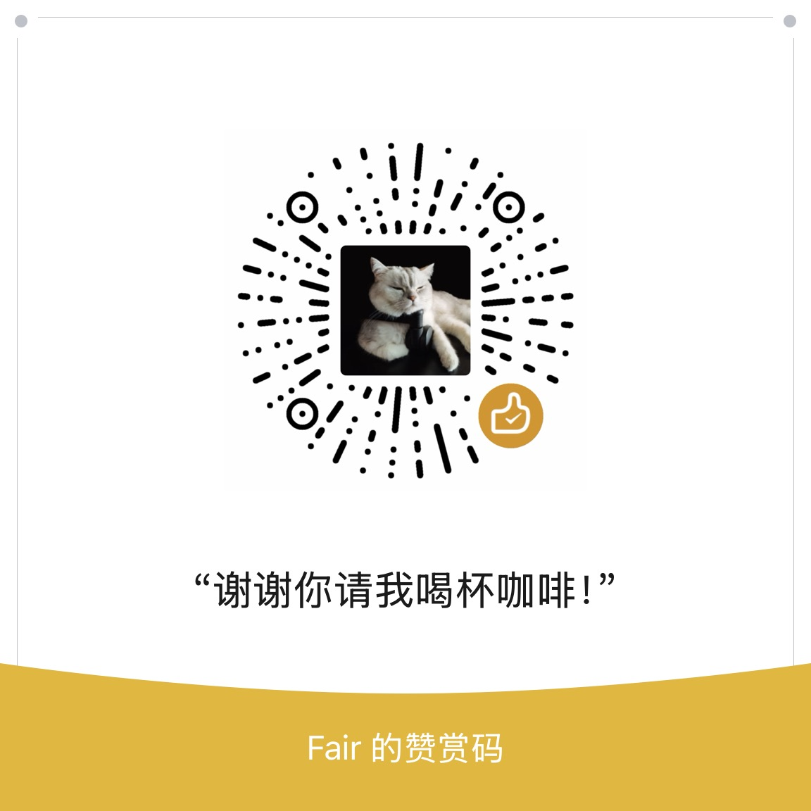

# dsh-money
> DeepSeek Harness 费用追踪插件 —— 实时显示账号余额、当前对话费用与每次回复费用，全部金额以金色（`#f0c11d`）标签（徽章）风格展示，估算费用带 `~` 符号。

        

显示 DeepSeek Harness 账号余额、当前对话费用与每次回复费用


鼠标悬停能显示详细信息


插件形式加载


设置货币类型



## 功能

| 显示项 | 说明 |
|---|---|
| **账号剩余金额** | 调用 DeepSeek `GET /user/balance` 接口获取，60 秒缓存自动刷新，显示在侧边栏底部 |
| **当前对话费用** | 折叠会话日志中每条 `assistant/message` 的 token 用量，按官方价目表实时计价并求和 |
| **每次回复费用** | 逐条回复独立计价，以金色标签显示在回复按钮行右侧 |
| **工作区总费用** | 侧边栏每个工作区行显示其全部会话的费用总和 |

### 界面

- **侧边栏底部余额**：`余额 [¥ 110.00]`，位于设置按钮下方，金色徽章样式，60 秒自动刷新
- **侧边栏工作区行**：每个工作区行右侧显示其总费用（如 `~¥ 8.72`），悬停显示会话数与估算说明
- **输入框下方统计行**（`conversation.composer.dock`）：`本对话 [~¥ 8.7188]`，金色徽章样式，30 秒自动刷新
- **每条回复费用标签**（`conversation.chat.assistant-actions`）：紧跟分支按钮右侧（时间戳保持最右），悬停显示模型与 token 明细（输入未命中 / 缓存命中 / 缓存写入 / 输出，全部带 `token` 单位）
- **设置页 → General**：可切换显示币种（自动跟随余额 / 人民币 ¥ / 美元 $）

### 显示约定

- **金色**：所有金钱文字统一金色 `#f0c11d`，圆角徽章（标签）风格
- **估算符号**：费用基于官方公开价目 × token 用量估算，统一加 `~` 前缀（如 `~¥ 0.0045`）；余额来自 API 为实际值，不加
- **¥ 空格**：人民币符号 `¥` 与数字之间带空格（如 `¥ 110.00`）；美元 `$` 不带
- **单位标注**：token 数量统一带单位（`1.2K token`、`328 token`）；悬停明细中的费用行注明 `（元，估算）` / `（美元，估算）`

### 计价口径

基于 [DeepSeek 官方价格页](https://api-docs.deepseek.com/zh-cn/quick_start/pricing)（2026-08 版，峰值价 = 空闲价 × 2）：

| 模型 | 币种 | 缓存命中（空闲） | 未命中（空闲） | 输出（空闲） |
|---|---|---|---|---|
| deepseek-v4-flash | ¥ / $ | 0.05 / 0.007 | 1.5 / 0.22 | 4.5 / 0.66 |
| deepseek-v4-pro | ¥ / $ | 0.15 / 0.022 | 4.5 / 0.66 | 13.5 / 1.98 |

> 单位：每百万 token。高峰时段 = 北京时间 9:00-12:00、14:00-18:00（即 UTC 01:00-04:00、06:00-10:00），价格翻倍。
>
> 账单口径：未命中输入（含 cache write）× miss 价 + 缓存命中 × hit 价 + 输出 × out 价。
>
> ⚠️ 费用为基于官方公开价目的估算值，不代表供应商最终账单。

### 计算流程

"本对话费用"、"每次回复费用"与"工作区费用"按以下 5 步计算：

1. **读取会话日志**：通过 `sessionQuery.readSession(sessionId)` 读取会话事件，只取 `assistant/message` 事件（每个事件 = 一次模型回复，含该次调用的 token 用量；工具调用、重试不会重复计数）
2. **提取 token 用量**：每个事件的 `usage` 为互斥计数——`inputTokens`（未命中输入）、`cacheReadTokens`（缓存命中）、`outputTokens`（输出，含思考）
3. **逐条计价**：`本次费用 = 未命中输入 × miss价 + 缓存命中 × hit价 + 输出 × out价`（每百万 token，÷ 1,000,000）
4. **峰谷判定**：按该回复的时间戳判断——高峰时段（北京 9:00-12:00、14:00-18:00）三档价格全部 × 2
5. **求和**：会话内所有回复费用相加 = 本对话费用；同一工作区内所有会话费用相加 = 工作区总费用；单条即每次回复费用

**计算示例**（deepseek-v4-flash 空闲时段，CNY）：

```
usage: input 736 / cacheRead 492,928 / output 816
费用 = 736×¥1.5/M + 492,928×¥0.05/M + 816×¥4.5/M
     = ¥0.0294224（≈ ~¥ 0.0294）
```

**余额**：来自 `GET /user/balance` 接口，是**实际值**（不加 `~`）；费用为估算值（带 `~`）。

## 安装

> **说明**：本插件是标准 DSH 静态插件（host 半段为 `TypertRemoteService` + `@Remote`，client 半段为 `__ModuleLoader__` bundle），`npm i` 后挂载一行即生效、重启不丢失。当前版本 **1.1.0**。

### 安装步骤

```bash
npm i dsh-money          # 或 pnpm add dsh-money
```

在 DSH profile 的 `cordis.patch.yml`（如 `~/.dsh/profiles/web/cordis.patch.yml`）中添加一行：

```yaml
- insert:
    - id: money
      name: 'dsh-money'
```

重启 DSH（或触发 profile 重载）后生效。**不再需要动态定义或技能**。

**更新到最新版**：

```bash
npm update dsh-money     # 或 pnpm update dsh-money
```

### 直接 clone 仓库（开发）

```bash
git clone https://github.com/yanhuifair/dsh-money.git
cd dsh-money
npm install
npm run build            # 生成 lib/（typert 产物 + client bundle）
```

## 配置

插件自动读取已有 DeepSeek 配置：

- **API Key**：`ctx.credentials` 服务（默认引用 `DEEPSEEK_API_KEY`），也可通过设置 `llm-deepseek.apiKeyEnv` 覆盖
- **Base URL**：默认 `https://api.deepseek.com`，可通过设置 `llm-deepseek.baseURL` 覆盖（兼容网关/代理）

**显示币种**：设置页 → General → “费用显示货币”，可选：

- `自动（跟随余额）`：余额为 USD 则按美元价目显示，否则按人民币
- `人民币 ¥` / `美元 $`：强制按对应价目表计算并显示

> 币种设置保存在 DSH host 进程内（静态插件进程级记忆），重启后恢复为“自动”。

## 开发

```bash
git clone https://github.com/yanhuifair/dsh-money.git
cd dsh-money
npm install
npm run build            # 生成 packages/dsh-money/lib/（typert 产物 + client bundle）
```

插件源码结构（monorepo）：

```
packages/dsh-money/
├── src/
│   ├── index.ts        # Host 半段：MoneyCostService（TypertRemoteService + @Remote）
│   ├── types.ts        # Remote 边界类型（公开导出）
│   ├── client.ts       # Client 半段类型入口
│   └── client.static.js# Client 半段实现（__ModuleLoader__ bundle 源码）
├── lib/                # 构建产物（typert.host.js / typert.remote-client.js / client.js / index.js）
└── package.json        # dsh.client 声明 + ./typert ./remote 导出
```

## 许可证

[GNU Affero General Public License v3.0](LICENSE) © yanhuifair

AGPL-3.0 是强 copyleft 协议：你可以自由使用、修改与分发，但基于本插件的修改版本必须同样以 AGPL-3.0 开源，并保留版权声明。

## 微信打赏
真的很需要大家的支持和鼓励

